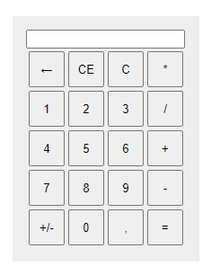

# Task 1

1) Describe typical use-cases of simple calculator:

2) Download and open [calculator.html](task01_media/calculator.html)

3) You will see an application that implements the calculator. You need to find and describe all it's bugs/errors. Start with checking if it passes all your use-cases.

    For each found bug/error:
    - give name
    - write steps to reproduce it
    
    You need to find at least 5 bugs/errors
